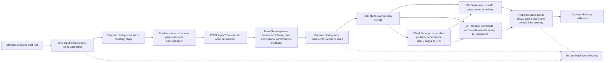
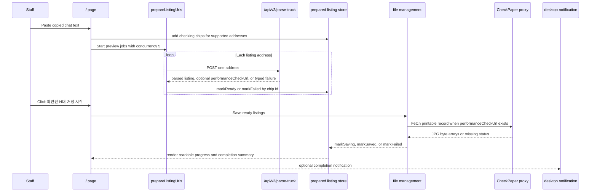

# Truck Harvester Architecture

The rebuilt app is served from `/`. The implementation still lives under
`src/v2/*` as an internal namespace, but users no longer need to open a
separate `/v2` route. The old `/v2` URL redirects to `/` for compatibility.

The runtime has no external error-monitoring SDK or image-stamping pipeline.
Vehicle images are fetched and saved directly. Performance check records are
resolved from the listing's `성능점검보기` link, rendered from the printable
CheckPaper record, and saved as JPG files. The current parse API is
`POST /api/v2/parse-truck`.

## Runtime Flow



Umami Cloud analytics loads only in production with the fixed Truck Harvester
website script from Umami Cloud. The app records aggregate batch funnel events
for paste, preview, and save milestones. Only failed listings and non-empty
unsupported input failures send listing diagnostics such as listing URL,
bounded input sample, vehicle number, and vehicle name; successful listings are
represented by counts only. Unsupported input samples are whitespace-normalized,
capped at 160 characters, and sent at most once per failed paste.

The application workflow layer emits business facts to a workflow analytics
adapter. The route component and widgets do not assemble Umami payloads, and
preview/save use cases do not call `window.umami` directly. The shared
analytics transport remains the only layer that knows the concrete Umami event
names and payload keys.

The client owns preview scheduling with concurrency 5. The server endpoint
accepts one address at a time so each request can stay inside the short
Vercel Hobby execution budget. The visible user state is the prepared
listing list: raw URLs are translated into readable listing-name chips
before saving starts.

## Sequence



Route-level controllers abort active preview and save work when the root app
unmounts. New paste runs do not cancel earlier checking chips; only the latest
paste run may update helper text such as duplicate warnings.

## Save Folder Persistence

The root save-folder selector keeps the selected directory handle only in
React component state for the active page session. Users choose a save folder
before saving through the File System Access API, and the app requests
read/write permission from that user-triggered save flow before writing.

The app does not use IndexedDB for save-folder persistence and does not restore
a saved handle after reloads or new browser sessions. After a reload or reopen,
users choose the save folder again.

## Saved File Structure

Each saved listing gets a vehicle-number folder. The directory save path and
ZIP fallback use the same layout:

```text
선택한 저장 폴더/
└─ 서울80바1234/
   ├─ 차량 이미지/
   │  ├─ K-001.jpg
   │  └─ K-002.jpg
   ├─ 성능점검기록부/
   │  ├─ 서울80바1234_성능점검기록부_1.jpg
   │  └─ 서울80바1234_성능점검기록부_2.jpg
   └─ 원고/
      └─ 서울80바1234 원고.txt
```

Vehicle image files keep the existing `K-001.jpg` naming convention. Manuscript
and performance-check file names include the sanitized vehicle number so users
can identify files after moving them between folders.

The manuscript's `기타사항` block is generated for manual SmartStore entry. It
contains `차명`, `연식`, `주행거리`, `차량번호`, and `차량정보`; `연식` uses the
listing's `최초등록` date as `yyyy년 m월 등록`. The `차량정보` value comes from
the listing description's `상부` and `하부` labels. If a label's value continues
across multiple paragraphs before the next `차명`/`상부`/`하부` label or seller
intro separator, those continuation paragraphs are preserved in the manuscript
with extra indentation. When both `상부` and `하부` are empty, the manuscript
uses `차량정보 : 정보 없음`; when only one side is empty, both rows are still
rendered and the missing side is `정보 없음`.

Performance-check saving is non-fatal. If the listing has no usable
performance-check record or the printable record cannot be rendered, the
vehicle images and manuscript still save successfully. The completion summary
shows one quiet Korean notice asking the user to check the affected vehicle
folder before SmartStore registration.

## CheckPaper Integration

`POST /api/v2/parse-truck` returns `performanceCheckUrl` when the listing page
contains a `성능점검보기` link. During save, the client asks the same-origin
CheckPaper routes to resolve the record and then chooses the supported renderer:
existing CheckPaper `record.do` PDF pages are rendered as JPGs in the browser,
and Carmodoo `carmodooPrint.do?checkNum=7126000658` HTML records are rendered
through a same-origin native browser renderer API so the saved JPGs match the
browser layout.

- `GET /api/v2/checkpaper` fetches supported CheckPaper or intermediate pages,
  follows redirects, and rewrites assets to same-origin URLs.
- `GET /api/v2/checkpaper/asset` proxies supported CSS, image, script, and
  printable record assets.
- `POST /api/v2/checkpaper/carmodoo-render` accepts only Carmodoo print URLs,
  opens the approved Carmodoo page directly in the native browser renderer, and
  returns the rendered JPG pages for the save flow.

The app does not upload these records anywhere; it only saves them into the
user's selected folder or ZIP file. Performance-check saving remains non-fatal.

## Layer Responsibilities

- `src/app`: root route composition, page layout, and widget wiring.
- `src/v2/application`: root app workflow orchestration, React hook adapters,
  and workflow analytics boundaries.
- `src/v2/widgets`: user-facing blocks that compose features and shared
  selectors.
- `src/v2/features`: capabilities such as listing preparation, parsing,
  saving, performance-check rendering, completion notifications, and
  onboarding.
- `src/v2/entities`: pure schemas and state contracts.
- `src/v2/shared`: utilities, parser helpers, stores, selectors, analytics
  transport, and low-level UI.
- `src/v2/design-system`: tokens and motion presets for the root app.

## Guardrails

- No external error-monitoring SDK.
- No image-stamping pipeline.
- User-facing copy is Korean-only.
- Default concurrency is 5.
- New deferred work should become a GitHub issue instead of staying as a
  loose TODO.
