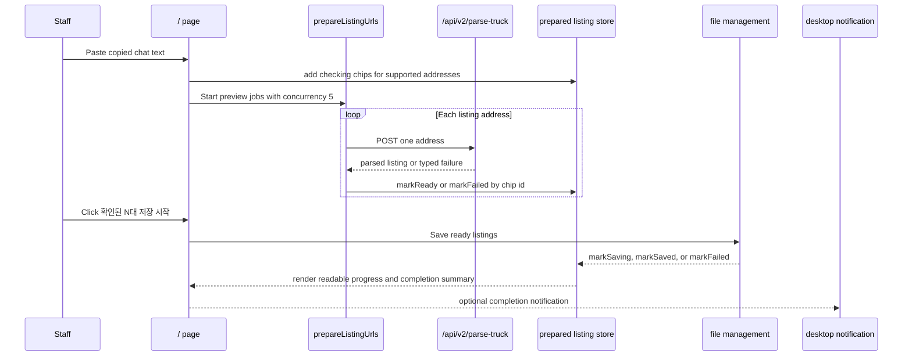

# Truck Harvester Architecture

The rebuilt app is served from `/`. The implementation still lives under
`src/v2/*` as an internal namespace, but users no longer need to open a
separate `/v2` route. The old `/v2` URL redirects to `/` for compatibility.

The runtime does not use Sentry or watermarking. Images are fetched and saved
directly, and the current parse API is `POST /api/v2/parse-truck`.

## Runtime Flow

```mermaid
flowchart LR
  A["Staff paste copied chat text"] --> B["Chip input extracts truck listing addresses"]
  B --> C["Prepared listing store adds checking chips"]
  C --> D["Preview runner schedules parse jobs with concurrency 5"]
  D --> E["POST /api/v2/parse-truck once per address"]
  E --> F["Pure Cheerio parser returns truck listing data"]
  F --> G["Prepared listing store marks chips ready or failed"]
  G --> H["User starts saving ready listings"]
  H --> I["File System Access API saves per-truck folders"]
  H --> J["ZIP fallback downloads archive when folder saving is unavailable"]
  I --> K["Prepared status panel shows saved labels and completion summary"]
  J --> K
  K --> L["Optional desktop notification"]
```

The client owns preview scheduling with concurrency 5. The server endpoint
accepts one address at a time so each request can stay inside the short
Vercel Hobby execution budget. The visible user state is the prepared
listing list: raw URLs are translated into readable listing-name chips
before saving starts.

## Sequence

Route-level controllers abort active preview and save work when the root app
unmounts. New paste runs do not cancel earlier checking chips; only the latest
paste run may update helper text such as duplicate warnings.

## Save Folder Persistence

The root save-folder selector stores the selected
`FileSystemDirectoryHandle` in IndexedDB so a refreshed or returning
Chromium user can see the last selected folder. The app still calls
`queryPermission({ mode: 'readwrite' })` after restore and
`requestPermission({ mode: 'readwrite' })` from a user-triggered save action
before writing, because browser permission can expire when the origin's tabs
close.

## Layer Responsibilities

- `src/app`: root route composition, page layout, and wiring.
- `src/v2/widgets`: user-facing blocks that compose features and shared
  selectors.
- `src/v2/features`: workflows such as listing preparation, parsing,
  saving, completion notifications, and onboarding.
- `src/v2/entities`: pure schemas and state contracts.
- `src/v2/shared`: utilities, stores, selectors, and low-level UI.
- `src/v2/design-system`: tokens and motion presets for the root app.

## Guardrails

- No Sentry.
- No watermarking.
- User-facing copy is Korean-only.
- Default concurrency is 5.
- New deferred work should become a GitHub issue instead of staying as a
  loose TODO.
