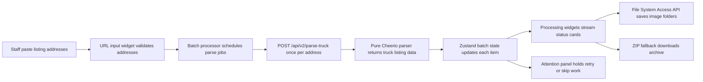
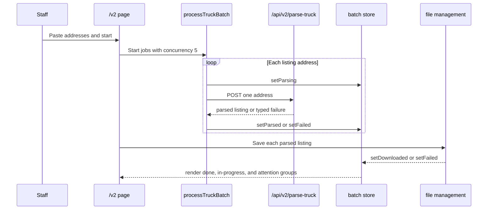

# Truck Harvester v2 Architecture

`/v2` is a parallel rebuild. It must not break the legacy `/` route and it
must not import legacy watermarking or Sentry code.

## Runtime Flow

The client owns scheduling with concurrency 5. The server endpoint accepts
one address at a time so each request can stay inside the short Vercel
Hobby execution budget.

## Sequence

## Layer Responsibilities

- `src/app/v2`: route composition, page layout, and wiring.
- `src/v2/widgets`: user-facing blocks that compose features and shared
  selectors.
- `src/v2/features`: workflows such as parsing, saving, and onboarding.
- `src/v2/entities`: pure schemas and state contracts.
- `src/v2/shared`: utilities, stores, selectors, and low-level UI.
- `src/v2/design-system`: tokens and motion presets for `/v2`.

## Guardrails

- No Sentry in `/v2`.
- No watermark in `/v2`.
- User-facing copy is Korean-only.
- Default concurrency is 5.
- New deferred work should become a GitHub issue instead of staying as a
  loose TODO.
