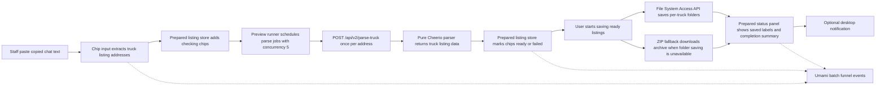
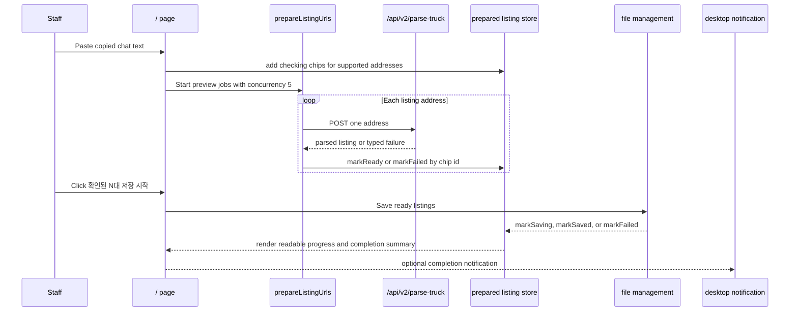

# Truck Harvester Architecture

The rebuilt app is served from `/`. The implementation still lives under
`src/v2/*` as an internal namespace, but users no longer need to open a
separate `/v2` route. The old `/v2` URL redirects to `/` for compatibility.

The runtime has no external error-monitoring SDK or image-stamping pipeline.
Images are fetched and saved directly, and the current parse API is
`POST /api/v2/parse-truck`.

## Runtime Flow

Umami Cloud analytics loads only in production with the fixed Truck Harvester
website script from Umami Cloud. The app records aggregate batch funnel events
for paste, preview, and save milestones. Only failed listings and non-empty
unsupported input failures send listing diagnostics such as listing URL,
bounded input sample, vehicle number, and vehicle name; successful listings are
represented by counts only. Unsupported input samples are whitespace-normalized,
capped at 160 characters, and sent at most once per failed paste.

The application workflow layer emits business facts to a workflow analytics
adapter. The route component and widgets do not assemble Umami payloads, and
preview/save use cases do not call `window.umami` directly. The shared
analytics transport remains the only layer that knows the concrete Umami event
names and payload keys.

The client owns preview scheduling with concurrency 5. The server endpoint
accepts one address at a time so each request can stay inside the short
Vercel Hobby execution budget. The visible user state is the prepared
listing list: raw URLs are translated into readable listing-name chips
before saving starts.

## Sequence

Route-level controllers abort active preview and save work when the root app
unmounts. New paste runs do not cancel earlier checking chips; only the latest
paste run may update helper text such as duplicate warnings.

## Save Folder Persistence

The root save-folder selector keeps the selected directory handle only in
React component state for the active page session. Users choose a save folder
before saving through the File System Access API, and the app requests
read/write permission from that user-triggered save flow before writing.

The app does not use IndexedDB for save-folder persistence and does not restore
a saved handle after reloads or new browser sessions. After a reload or reopen,
users choose the save folder again.

## Layer Responsibilities

- `src/app`: root route composition, page layout, and widget wiring.
- `src/v2/application`: root app workflow orchestration, React hook adapters,
  and workflow analytics boundaries.
- `src/v2/widgets`: user-facing blocks that compose features and shared
  selectors.
- `src/v2/features`: capabilities such as listing preparation, parsing,
  saving, completion notifications, and onboarding.
- `src/v2/entities`: pure schemas and state contracts.
- `src/v2/shared`: utilities, stores, selectors, analytics transport, and
  low-level UI.
- `src/v2/design-system`: tokens and motion presets for the root app.

## Guardrails

- No external error-monitoring SDK.
- No image-stamping pipeline.
- User-facing copy is Korean-only.
- Default concurrency is 5.
- New deferred work should become a GitHub issue instead of staying as a
  loose TODO.
