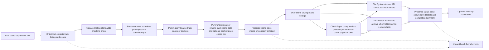
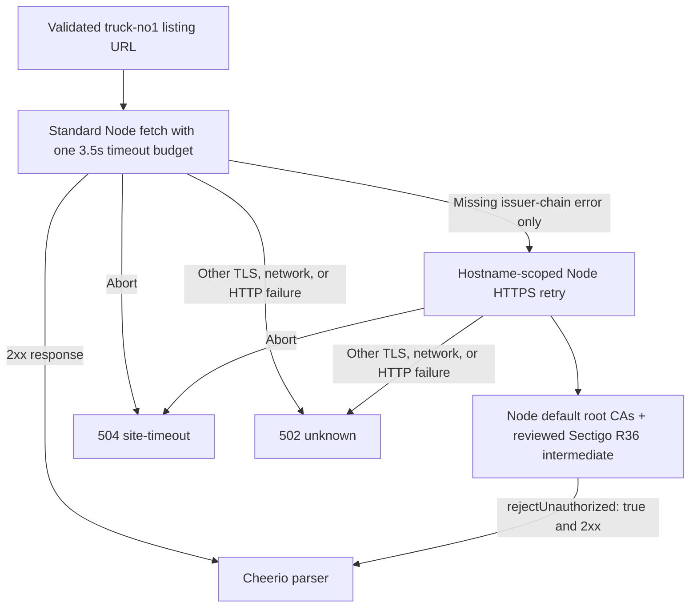
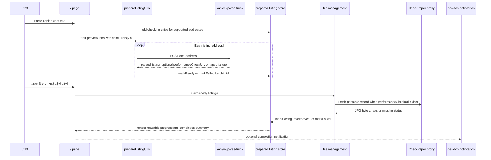
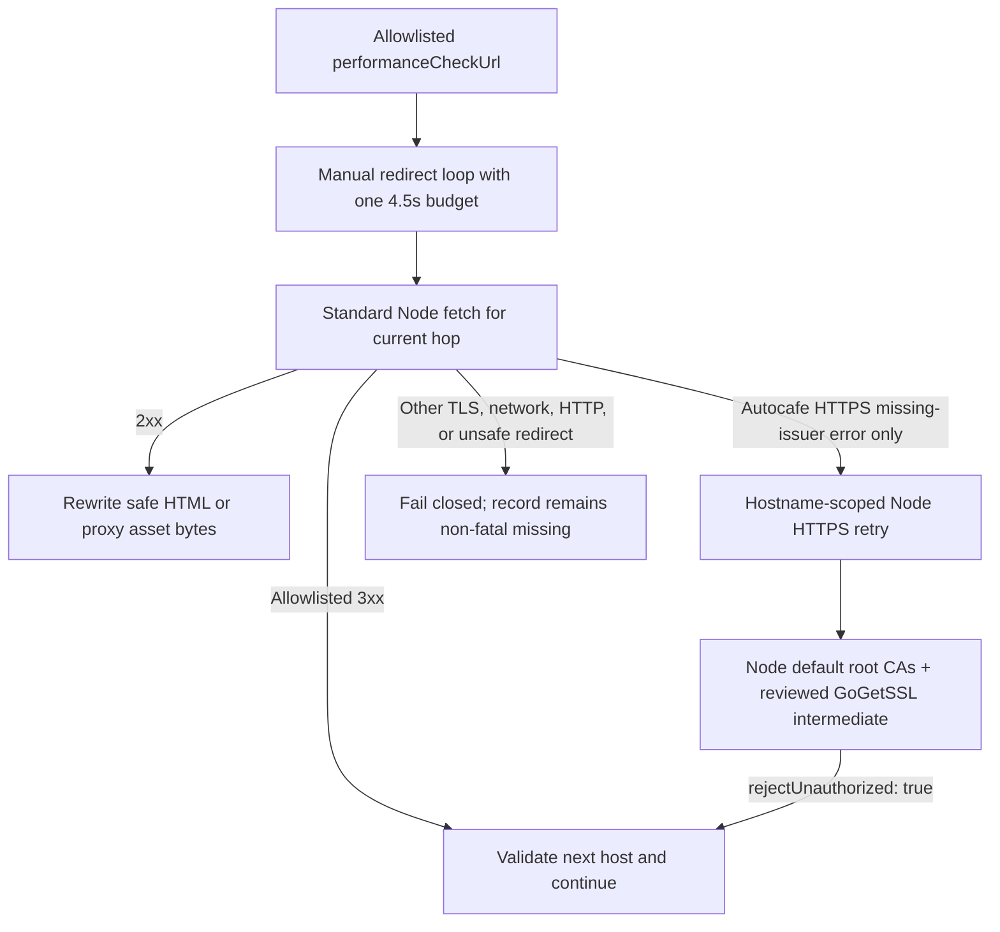

# Truck Harvester Architecture

The rebuilt app is served from `/`. The implementation still lives under
`src/v2/*` as an internal namespace, but users no longer need to open a
separate `/v2` route. The old `/v2` URL redirects to `/` for compatibility.

The runtime has no external error-monitoring SDK or image-stamping pipeline.
Vehicle images are fetched and saved directly. Performance check records are
resolved from the listing's `성능점검보기` link, rendered from the printable
CheckPaper record, and saved as JPG files. The current parse API is
`POST /api/v2/parse-truck`.

## Runtime Flow


```mermaid
flowchart LR
  A["Staff paste copied chat text"] --> B["Chip input extracts truck listing addresses"]
  B --> C["Prepared listing store adds checking chips"]
  C --> D["Preview runner schedules parse jobs with concurrency 5"]
  D --> E["POST /api/v2/parse-truck once per address"]
  E --> F["Pure Cheerio parser returns truck listing data and optional performance-check link"]
  F --> G["Prepared listing store marks chips ready or failed"]
  G --> H["User starts saving ready listings"]
  H --> I["File System Access API saves per-truck folders"]
  H --> J["ZIP fallback downloads archive when folder saving is unavailable"]
  H --> N["CheckPaper proxy renders printable performance-check pages as JPG"]
  N --> I
  N --> J
  I --> K["Prepared status panel shows saved labels and completion summary"]
  J --> K
  K --> L["Optional desktop notification"]
  B -.-> M["Umami batch funnel events"]
  G -.-> M
  K -.-> M
```

Umami Cloud analytics loads only in production with the fixed Truck Harvester
website script from Umami Cloud. The app records aggregate batch funnel events
for paste, preview, and save milestones. Only failed listings and non-empty
unsupported input failures send listing diagnostics such as listing URL,
bounded input sample, vehicle number, and vehicle name; successful listings are
represented by counts only. Unsupported input samples are whitespace-normalized,
capped at 160 characters, and sent at most once per failed paste.

The application workflow layer emits business facts to a workflow analytics
adapter. The route component and widgets do not assemble Umami payloads, and
preview/save use cases do not call `window.umami` directly. The shared
analytics transport remains the only layer that knows the concrete Umami event
names and payload keys.

The client owns preview scheduling with concurrency 5. The server endpoint
accepts one address at a time so each request can stay inside the short
Vercel Hobby execution budget. The visible user state is the prepared
listing list: raw URLs are translated into readable listing-name chips
before saving starts.

## Listing Source Fetch Trust Boundary

`POST /api/v2/parse-truck` validates the hostname, path, and required query
parameters before any external request. The route delegates the source request
to `src/app/api/v2/parse-truck/fetch-listing-html.ts`, then passes successful
HTML to the pure Cheerio parser.


```mermaid
flowchart TD
  A["Validated truck-no1 listing URL"] --> B["Standard Node fetch with one 3.5s timeout budget"]
  B -->|"2xx response"| C["Cheerio parser"]
  B -->|"Missing issuer-chain error only"| D["Hostname-scoped Node HTTPS retry"]
  D --> E["Node default root CAs + reviewed Sectigo R36 intermediate"]
  E -->|"rejectUnauthorized: true and 2xx"| C
  B -->|"Abort"| F["504 site-timeout"]
  D -->|"Abort"| F
  B -->|"Other TLS, network, or HTTP failure"| G["502 unknown"]
  D -->|"Other TLS, network, or HTTP failure"| G
```

The standard fetch remains the primary path. The retry activates only for
`UNABLE_TO_GET_ISSUER_CERT`, `UNABLE_TO_GET_ISSUER_CERT_LOCALLY`, or
`UNABLE_TO_VERIFY_LEAF_SIGNATURE`, because the listing source has served its
leaf certificate without the public Sectigo R36 intermediate. Both attempts
share one `AbortController`, so recovery does not reset or extend the
request-level timeout.

The intermediate certificate is public trust material, not a secret. The
fallback still preserves Node's default roots, restricts the request to
`www.truck-no1.co.kr`, and keeps `rejectUnauthorized: true`; hostname and
certificate verification remain active. Expired certificates, hostname
mismatches, unrelated TLS failures, and non-2xx responses are never bypassed.
The fallback uses `Accept-Encoding: identity` and does not add redirect
following. If the source introduces redirects, each destination must be
allowlisted and threat-reviewed before redirect support is added.

The rationale, rejected alternatives, certificate lifecycle, and removal
criteria are recorded in
`docs/decisions/0006-listing-source-tls-chain-recovery.md`. Operational
diagnosis and renewal commands live in
`docs/runbooks/debug-failed-scrape.md`.

## Sequence


```mermaid
sequenceDiagram
  participant User as Staff
  participant Page as / page
  participant Prep as prepareListingUrls
  participant API as /api/v2/parse-truck
  participant Store as prepared listing store
  participant Save as file management
  participant Check as CheckPaper proxy
  participant Notify as desktop notification

  User->>Page: Paste copied chat text
  Page->>Store: add checking chips for supported addresses
  Page->>Prep: Start preview jobs with concurrency 5
  loop Each listing address
    Prep->>API: POST one address
    API-->>Prep: parsed listing, optional performanceCheckUrl, or typed failure
    Prep->>Store: markReady or markFailed by chip id
  end
  User->>Page: Click 확인된 N대 저장 시작
  Page->>Save: Save ready listings
  Save->>Check: Fetch printable record when performanceCheckUrl exists
  Check-->>Save: JPG byte arrays or missing status
  Save-->>Store: markSaving, markSaved, or markFailed
  Store-->>Page: render readable progress and completion summary
  Page-->>Notify: optional completion notification
```

Route-level controllers abort active preview and save work when the root app
unmounts. New paste runs do not cancel earlier checking chips; only the latest
paste run may update helper text such as duplicate warnings.

## Save Folder Persistence

The root save-folder selector keeps the selected directory handle only in
React component state for the active page session. Users choose a save folder
before saving through the File System Access API, and the app requests
read/write permission from that user-triggered save flow before writing.

The app does not use IndexedDB for save-folder persistence and does not restore
a saved handle after reloads or new browser sessions. After a reload or reopen,
users choose the save folder again.

## Saved File Structure

Each saved listing gets a vehicle-number folder. The directory save path and
ZIP fallback use the same layout:

```text
선택한 저장 폴더/
└─ 서울80바1234/
   ├─ 차량 이미지/
   │  ├─ K-001.jpg
   │  └─ K-002.jpg
   ├─ 성능점검기록부/
   │  ├─ 서울80바1234_성능점검기록부_1.jpg
   │  └─ 서울80바1234_성능점검기록부_2.jpg
   └─ 원고/
      └─ 서울80바1234 원고.txt
```

Vehicle image files keep the existing `K-001.jpg` naming convention. Manuscript
and performance-check file names include the sanitized vehicle number so users
can identify files after moving them between folders.

The manuscript's `기타사항` block is generated for manual SmartStore entry. It
contains `차명`, `연식`, `주행거리`, `차량번호`, and `차량정보`; `연식` uses the
listing's `최초등록` date as `yyyy년 m월 등록`. The `차량정보` value comes from
the listing description's `상부` and `하부` labels. If a label's value continues
across multiple paragraphs before the next `차명`/`상부`/`하부` label or seller
intro separator, those continuation paragraphs are preserved in the manuscript
with extra indentation. When both `상부` and `하부` are empty, the manuscript
uses `차량정보 : 정보 없음`; when only one side is empty, both rows are still
rendered and the missing side is `정보 없음`.

Performance-check saving is non-fatal. If the listing has no usable
performance-check record or the printable record cannot be rendered, the
vehicle images and manuscript still save successfully. The completion summary
shows one quiet Korean notice asking the user to check the affected vehicle
folder before SmartStore registration.

## CheckPaper Integration

`POST /api/v2/parse-truck` returns `performanceCheckUrl` when the listing page
contains a `성능점검보기` link. During save, the client asks the same-origin
CheckPaper routes to resolve the record and then chooses the supported renderer:
existing CheckPaper `record.do` PDF pages are rendered as JPGs in the browser,
and Carmodoo `carmodooPrint.do?checkNum=7126000658` HTML records are rendered
through a same-origin native browser renderer API so the saved JPGs match the
browser layout.

- `GET /api/v2/checkpaper` fetches supported CheckPaper or intermediate pages,
  follows redirects, and rewrites assets to same-origin URLs.
- `GET /api/v2/checkpaper/asset` proxies supported CSS, image, script, and
  printable record assets.
- `POST /api/v2/checkpaper/carmodoo-render` accepts only Carmodoo print URLs,
  opens the approved Carmodoo page directly in the native browser renderer, and
  returns the rendered JPG pages for the save flow. Vercel deployments use
  `@sparticuz/chromium` and bundled Noto Sans KR font faces for this renderer,
  because the serverless Chromium runtime does not include CJK fonts.

The initial performance-check link normally enters through `autocafe.co.kr`
before redirecting to CheckPaper or Carmodoo. Autocafe currently omits its
public `GoGetSSL RSA DV CA` intermediate certificate. Standard Node `fetch`
therefore fails on the HTTPS redirect hop even though browsers may complete the
chain.


```mermaid
flowchart TD
  A["Allowlisted performanceCheckUrl"] --> B["Manual redirect loop with one 4.5s budget"]
  B --> C["Standard Node fetch for current hop"]
  C -->|"2xx"| D["Rewrite safe HTML or proxy asset bytes"]
  C -->|"Allowlisted 3xx"| E["Validate next host and continue"]
  C -->|"Autocafe HTTPS missing-issuer error only"| F["Hostname-scoped Node HTTPS retry"]
  F --> G["Node default root CAs + reviewed GoGetSSL intermediate"]
  G -->|"rejectUnauthorized: true"| E
  C -->|"Other TLS, network, HTTP, or unsafe redirect"| H["Fail closed; record remains non-fatal missing"]
```

The fallback is restricted to exact host `autocafe.co.kr`, known
missing-issuer codes, the current hop, and the existing shared timeout/abort
budget. It preserves `rejectUnauthorized: true`; it does not affect
`checkpaper.jmenetworks.co.kr`, `ck.carmodoo.com`, or unrelated outbound
requests. Redirect destinations remain restricted by the existing CheckPaper
allowlist.

The rationale, rejected alternatives, reviewed certificate identity, expiry,
and removal criteria are in
`docs/decisions/0007-autocafe-tls-chain-recovery.md`. Repeatable diagnosis is in
`docs/runbooks/debug-failed-scrape.md`, and the incident evidence is preserved
in `docs/references/autocafe-tls-chain.md`.

The app does not upload these records anywhere; it only saves them into the
user's selected folder or ZIP file. Performance-check saving remains non-fatal.

## Quality Gates

Pull requests and `main` pushes run the GitHub Actions `CI` workflow. The
workflow installs dependencies with Bun, installs Playwright Chromium, and then
runs:

- `bun run typecheck`
- `bun run lint`
- `bun run format:check`
- `bun run test -- --run`
- `bun run test:carmodoo-render`
- `bun run build`

`bun run test:carmodoo-render` is a focused Playwright smoke test for the
Carmodoo native renderer. It launches real Chromium, renders a Korean fixture
through the same renderer code path, and verifies that the produced JPG contains
enough dark pixel coverage across rows and columns to prove Korean glyphs were
painted instead of disappearing as tofu or empty boxes.

## Layer Responsibilities

- `src/app`: root route composition, page layout, and widget wiring.
- `src/v2/application`: root app workflow orchestration, React hook adapters,
  and workflow analytics boundaries.
- `src/v2/widgets`: user-facing blocks that compose features and shared
  selectors.
- `src/v2/features`: capabilities such as listing preparation, parsing,
  saving, performance-check rendering, completion notifications, and
  onboarding.
- `src/v2/entities`: pure schemas and state contracts.
- `src/v2/shared`: utilities, parser helpers, stores, selectors, analytics
  transport, and low-level UI.
- `src/v2/design-system`: tokens and motion presets for the root app.

## Guardrails

- No external error-monitoring SDK.
- No image-stamping pipeline.
- User-facing copy is Korean-only.
- Default concurrency is 5.
- New deferred work should become a GitHub issue instead of staying as a
  loose TODO.
