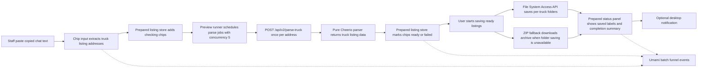

# Umami Analytics Implementation Plan

> **For agentic workers:** REQUIRED SUB-SKILL: Use superpowers:subagent-driven-development (recommended) or superpowers:executing-plans to implement this plan task-by-task. Steps use checkbox (`- [ ]`) syntax for tracking.

**Goal:** Add Umami Cloud analytics that measures the Truck Harvester work funnel from paste through save completion, while collecting listing identifiers only for failed listings.

**Architecture:** Load the optional Umami tracker from the root layout only when a public website id is configured. Keep all product analytics calls behind a safe `src/v2/shared/lib/analytics.ts` wrapper, and let `TruckHarvesterApp` own batch lifetime because it already coordinates paste, preview, save, and notification state. Batch events carry aggregate counts; only `listing_failed` events carry `listing_url`, `vehicle_number`, and `vehicle_name`.

**Tech Stack:** Next.js App Router, `next/script`, React 19, TypeScript strict mode, Vitest, Umami Cloud tracker.

---

## Scope Check

This plan covers one subsystem: product analytics for the current root Truck Harvester flow. It does not build custom Umami dashboards, self-host Umami, add an external error-monitoring SDK, collect user account identifiers, or add image-level telemetry.

## File Structure

- Create `src/app/umami-script-config.ts`: Parse public env vars into an optional script config for `RootLayout`.
- Create `src/app/__tests__/umami-script-config.test.ts`: Prove tracker script config is disabled by default and enabled from env.
- Modify `src/app/layout.tsx`: Render the Umami tracker with `next/script` when config exists.
- Modify `.env.example`: Document Umami Cloud env variables without enabling them by default.
- Create `src/v2/shared/lib/analytics.ts`: Define event names, payload types, payload builders, safe tracking helpers, and batch id generation.
- Create `src/v2/shared/lib/__tests__/analytics.test.ts`: Cover payload shaping, identifier boundaries, missing tracker behavior, and thrown tracker behavior.
- Modify `src/app/truck-harvester-app.tsx`: Track batch start, preview completion, save start, save completion, save failure, and failed listing details.
- Modify `src/app/__tests__/truck-harvester-app.test.tsx`: Verify analytics calls across success, preview failure, invalid listing, and save failure flows.
- Modify `docs/architecture.md`: Document that Umami analytics observes aggregate funnel events and failed listing details.
- Modify `AGENTS.md`: Add Umami analytics to the stack/map without weakening the no error-monitoring SDK rule.

## Event Contract

Event names:

- `batch_started`
- `preview_completed`
- `save_started`
- `save_completed`
- `save_failed`
- `listing_failed`

Batch payload keys:

- `batch_id`
- `url_count`
- `unique_url_count`
- `ready_count`
- `invalid_count`
- `preview_failed_count`
- `saved_count`
- `save_failed_count`
- `duration_ms`
- `save_method`
- `filesystem_supported`
- `notification_enabled`

Failure payload keys:

- `batch_id`
- `failure_stage`
- `failure_reason`
- `listing_url`
- `vehicle_number`
- `vehicle_name`
- `image_count`
- `elapsed_ms`

## Task 1: Configure The Optional Umami Tracker Script

**Files:**

- Create: `src/app/umami-script-config.ts`
- Create: `src/app/__tests__/umami-script-config.test.ts`
- Modify: `src/app/layout.tsx`
- Modify: `.env.example`

- [ ] **Step 1: Write the failing script config tests**

Create `src/app/__tests__/umami-script-config.test.ts`:

```ts
import { describe, expect, it } from 'vitest'

import { getUmamiScriptConfig } from '../umami-script-config'

describe('getUmamiScriptConfig', () => {
  it('disables the tracker when no Umami website id is configured', () => {
    expect(getUmamiScriptConfig({})).toBeNull()
    expect(getUmamiScriptConfig({ NEXT_PUBLIC_UMAMI_WEBSITE_ID: '   ' })).toBeNull()
  })

  it('uses the Umami Cloud script by default when a website id is configured', () => {
    expect(
      getUmamiScriptConfig({
        NEXT_PUBLIC_UMAMI_WEBSITE_ID: 'website-123',
      })
    ).toEqual({
      websiteId: 'website-123',
      src: 'https://cloud.umami.is/script.js',
      domains: undefined,
    })
  })

  it('allows the script source and domain filter to come from env', () => {
    expect(
      getUmamiScriptConfig({
        NEXT_PUBLIC_UMAMI_WEBSITE_ID: ' website-123 ',
        NEXT_PUBLIC_UMAMI_SCRIPT_SRC: ' https://analytics.example.com/script.js ',
        NEXT_PUBLIC_UMAMI_DOMAINS: ' truck-harvester.vercel.app,www.example.com ',
      })
    ).toEqual({
      websiteId: 'website-123',
      src: 'https://analytics.example.com/script.js',
      domains: 'truck-harvester.vercel.app,www.example.com',
    })
  })
})
```

- [ ] **Step 2: Run the config test to verify it fails**

Run:

```bash
bun run test -- --run src/app/__tests__/umami-script-config.test.ts
```

Expected: FAIL because `src/app/umami-script-config.ts` does not exist.

- [ ] **Step 3: Implement the script config helper**

Create `src/app/umami-script-config.ts`:

```ts
const defaultUmamiCloudScriptSrc = 'https://cloud.umami.is/script.js'

interface UmamiScriptEnv {
  NEXT_PUBLIC_UMAMI_WEBSITE_ID?: string
  NEXT_PUBLIC_UMAMI_SCRIPT_SRC?: string
  NEXT_PUBLIC_UMAMI_DOMAINS?: string
}

export interface UmamiScriptConfig {
  websiteId: string
  src: string
  domains?: string
}

const cleanOptionalEnv = (value: string | undefined) => {
  const trimmedValue = value?.trim()

  return trimmedValue && trimmedValue.length > 0 ? trimmedValue : undefined
}

export function getUmamiScriptConfig(env: UmamiScriptEnv = process.env): UmamiScriptConfig | null {
  const websiteId = cleanOptionalEnv(env.NEXT_PUBLIC_UMAMI_WEBSITE_ID)

  if (!websiteId) {
    return null
  }

  return {
    websiteId,
    src: cleanOptionalEnv(env.NEXT_PUBLIC_UMAMI_SCRIPT_SRC) ?? defaultUmamiCloudScriptSrc,
    domains: cleanOptionalEnv(env.NEXT_PUBLIC_UMAMI_DOMAINS),
  }
}
```

- [ ] **Step 4: Run the config test to verify it passes**

Run:

```bash
bun run test -- --run src/app/__tests__/umami-script-config.test.ts
```

Expected: PASS.

- [ ] **Step 5: Render the tracker script from the root layout**

Modify `src/app/layout.tsx`:

```tsx
import type { Metadata } from 'next'
import Script from 'next/script'

import { getUmamiScriptConfig } from './umami-script-config'
import './globals.css'
import './theme.css'
```

Add the config near `metadata`:

```tsx
const umamiScriptConfig = getUmamiScriptConfig()
```

Render the script inside `<body>` before the app wrapper:

```tsx
<body className="antialiased">
  {umamiScriptConfig ? (
    <Script
      data-domains={umamiScriptConfig.domains}
      data-website-id={umamiScriptConfig.websiteId}
      src={umamiScriptConfig.src}
      strategy="afterInteractive"
    />
  ) : null}
  <div className="v2-theme min-h-dvh">{children}</div>
</body>
```

- [ ] **Step 6: Document Umami env variables**

Modify `.env.example` by replacing the old commented analytics lines:

```dotenv
# Umami Cloud 분석 도구 (선택사항)
# NEXT_PUBLIC_UMAMI_WEBSITE_ID=your-umami-website-id
# NEXT_PUBLIC_UMAMI_SCRIPT_SRC=https://cloud.umami.is/script.js
# NEXT_PUBLIC_UMAMI_DOMAINS=truck-harvester.vercel.app
```

- [ ] **Step 7: Verify typecheck and commit**

Run:

```bash
bun run typecheck
```

Expected: PASS.

Commit:

```bash
git add .env.example src/app/layout.tsx src/app/umami-script-config.ts src/app/__tests__/umami-script-config.test.ts
git commit -m "feat: umami 스크립트 설정 추가"
```

## Task 2: Add The Safe Analytics Wrapper

**Files:**

- Create: `src/v2/shared/lib/analytics.ts`
- Create: `src/v2/shared/lib/__tests__/analytics.test.ts`

- [ ] **Step 1: Write failing analytics wrapper tests**

Create `src/v2/shared/lib/__tests__/analytics.test.ts`:

```ts
import { afterEach, describe, expect, it, vi } from 'vitest'

import {
  createAnalyticsBatchId,
  toBatchEventData,
  toListingFailureEventData,
  trackBatchStarted,
  trackListingFailed,
} from '../analytics'

const originalWindow = globalThis.window

function stubWindow(value: unknown) {
  Object.defineProperty(globalThis, 'window', {
    configurable: true,
    value,
  })
}

afterEach(() => {
  Object.defineProperty(globalThis, 'window', {
    configurable: true,
    value: originalWindow,
  })
  vi.restoreAllMocks()
})

describe('analytics payload builders', () => {
  it('creates stable-looking batch ids without user identifiers', () => {
    vi.spyOn(Date, 'now').mockReturnValue(1_700_000_000_000)
    vi.spyOn(Math, 'random').mockReturnValue(0.123456789)

    expect(createAnalyticsBatchId()).toBe('batch-loyw3v28-4fzzzx')
  })

  it('builds batch event data with aggregate fields only', () => {
    const data = toBatchEventData({
      batchId: 'batch-1',
      urlCount: 3,
      uniqueUrlCount: 2,
      readyCount: 1,
      invalidCount: 1,
      previewFailedCount: 0,
      savedCount: 1,
      saveFailedCount: 0,
      durationMs: 1234,
      saveMethod: 'directory',
      filesystemSupported: true,
      notificationEnabled: false,
    })

    expect(data).toEqual({
      batch_id: 'batch-1',
      url_count: 3,
      unique_url_count: 2,
      ready_count: 1,
      invalid_count: 1,
      preview_failed_count: 0,
      saved_count: 1,
      save_failed_count: 0,
      duration_ms: 1234,
      save_method: 'directory',
      filesystem_supported: true,
      notification_enabled: false,
    })
    expect(data).not.toHaveProperty('listing_url')
    expect(data).not.toHaveProperty('vehicle_number')
    expect(data).not.toHaveProperty('vehicle_name')
  })

  it('omits optional failure fields when the listing was never parsed', () => {
    expect(
      toListingFailureEventData({
        batchId: 'batch-1',
        failureStage: 'preview',
        failureReason: '매물 이름을 확인하지 못했어요',
        listingUrl:
          'https://www.truck-no1.co.kr/model/DetailView.asp?ShopNo=1&MemberNo=2&OnCarNo=3',
        elapsedMs: 900,
      })
    ).toEqual({
      batch_id: 'batch-1',
      failure_stage: 'preview',
      failure_reason: '매물 이름을 확인하지 못했어요',
      listing_url: 'https://www.truck-no1.co.kr/model/DetailView.asp?ShopNo=1&MemberNo=2&OnCarNo=3',
      elapsed_ms: 900,
    })
  })

  it('includes vehicle identifiers for parsed listings that fail during save', () => {
    expect(
      toListingFailureEventData({
        batchId: 'batch-1',
        failureStage: 'save',
        failureReason: '저장하지 못했어요',
        listingUrl:
          'https://www.truck-no1.co.kr/model/DetailView.asp?ShopNo=1&MemberNo=2&OnCarNo=3',
        vehicleNumber: '서울12가3456',
        vehicleName: '현대 메가트럭',
        imageCount: 2,
        elapsedMs: 1500,
      })
    ).toEqual({
      batch_id: 'batch-1',
      failure_stage: 'save',
      failure_reason: '저장하지 못했어요',
      listing_url: 'https://www.truck-no1.co.kr/model/DetailView.asp?ShopNo=1&MemberNo=2&OnCarNo=3',
      vehicle_number: '서울12가3456',
      vehicle_name: '현대 메가트럭',
      image_count: 2,
      elapsed_ms: 1500,
    })
  })
})

describe('analytics tracking', () => {
  it('does nothing when the Umami tracker is missing', () => {
    stubWindow({})

    expect(() =>
      trackBatchStarted({
        batchId: 'batch-1',
        urlCount: 1,
        uniqueUrlCount: 1,
        readyCount: 0,
        invalidCount: 0,
        previewFailedCount: 0,
        savedCount: 0,
        saveFailedCount: 0,
        durationMs: 0,
        filesystemSupported: true,
        notificationEnabled: false,
      })
    ).not.toThrow()
  })

  it('sends named events with event data to Umami', () => {
    const track = vi.fn()
    stubWindow({ umami: { track } })

    trackListingFailed({
      batchId: 'batch-1',
      failureStage: 'invalid_url',
      failureReason: '매물 정보를 찾지 못했어요',
      listingUrl: 'https://www.truck-no1.co.kr/model/DetailView.asp?ShopNo=1&MemberNo=2&OnCarNo=3',
      elapsedMs: 300,
    })

    expect(track).toHaveBeenCalledWith('listing_failed', {
      batch_id: 'batch-1',
      failure_stage: 'invalid_url',
      failure_reason: '매물 정보를 찾지 못했어요',
      listing_url: 'https://www.truck-no1.co.kr/model/DetailView.asp?ShopNo=1&MemberNo=2&OnCarNo=3',
      elapsed_ms: 300,
    })
  })

  it('swallows tracker errors so the app flow can continue', () => {
    stubWindow({
      umami: {
        track: vi.fn(() => {
          throw new Error('blocked')
        }),
      },
    })

    expect(() =>
      trackListingFailed({
        batchId: 'batch-1',
        failureStage: 'preview',
        failureReason: 'network',
        listingUrl:
          'https://www.truck-no1.co.kr/model/DetailView.asp?ShopNo=1&MemberNo=2&OnCarNo=3',
        elapsedMs: 1,
      })
    ).not.toThrow()
  })
})
```

- [ ] **Step 2: Run the analytics wrapper test to verify it fails**

Run:

```bash
bun run test -- --run src/v2/shared/lib/__tests__/analytics.test.ts
```

Expected: FAIL because `src/v2/shared/lib/analytics.ts` does not exist.

- [ ] **Step 3: Implement the analytics wrapper**

Create `src/v2/shared/lib/analytics.ts`:

```ts
type AnalyticsEventDataValue = string | number | boolean
type AnalyticsEventData = Record<string, AnalyticsEventDataValue>

declare global {
  interface Window {
    umami?: {
      track: (eventName: string, data?: AnalyticsEventData) => unknown
    }
  }
}

export type SaveMethod = 'directory' | 'zip'
export type FailureStage = 'invalid_url' | 'preview' | 'save'

export interface BatchAnalyticsInput {
  batchId: string
  urlCount: number
  uniqueUrlCount: number
  readyCount: number
  invalidCount: number
  previewFailedCount: number
  savedCount: number
  saveFailedCount: number
  durationMs: number
  saveMethod?: SaveMethod
  filesystemSupported: boolean
  notificationEnabled: boolean
}

export interface ListingFailureAnalyticsInput {
  batchId: string
  failureStage: FailureStage
  failureReason: string
  listingUrl: string
  vehicleNumber?: string
  vehicleName?: string
  imageCount?: number
  elapsedMs: number
}

type OptionalAnalyticsEventData = Record<string, AnalyticsEventDataValue | undefined>

const compactEventData = (data: OptionalAnalyticsEventData) =>
  Object.fromEntries(
    Object.entries(data).filter(([, value]) => value !== undefined)
  ) as AnalyticsEventData

const trackEvent = (eventName: string, data: OptionalAnalyticsEventData) => {
  if (typeof window === 'undefined') {
    return
  }

  try {
    window.umami?.track(eventName, compactEventData(data))
  } catch {
    // Analytics must never interrupt the dealership workflow.
  }
}

export function createAnalyticsBatchId() {
  return `batch-${Date.now().toString(36)}-${Math.random().toString(36).slice(2, 8)}`
}

export function toBatchEventData(input: BatchAnalyticsInput) {
  return compactEventData({
    batch_id: input.batchId,
    url_count: input.urlCount,
    unique_url_count: input.uniqueUrlCount,
    ready_count: input.readyCount,
    invalid_count: input.invalidCount,
    preview_failed_count: input.previewFailedCount,
    saved_count: input.savedCount,
    save_failed_count: input.saveFailedCount,
    duration_ms: input.durationMs,
    save_method: input.saveMethod,
    filesystem_supported: input.filesystemSupported,
    notification_enabled: input.notificationEnabled,
  })
}

export function toListingFailureEventData(input: ListingFailureAnalyticsInput) {
  return compactEventData({
    batch_id: input.batchId,
    failure_stage: input.failureStage,
    failure_reason: input.failureReason,
    listing_url: input.listingUrl,
    vehicle_number: input.vehicleNumber,
    vehicle_name: input.vehicleName,
    image_count: input.imageCount,
    elapsed_ms: input.elapsedMs,
  })
}

export const trackBatchStarted = (input: BatchAnalyticsInput) => {
  trackEvent('batch_started', toBatchEventData(input))
}

export const trackPreviewCompleted = (input: BatchAnalyticsInput) => {
  trackEvent('preview_completed', toBatchEventData(input))
}

export const trackSaveStarted = (input: BatchAnalyticsInput) => {
  trackEvent('save_started', toBatchEventData(input))
}

export const trackSaveCompleted = (input: BatchAnalyticsInput) => {
  trackEvent('save_completed', toBatchEventData(input))
}

export const trackSaveFailed = (input: BatchAnalyticsInput) => {
  trackEvent('save_failed', toBatchEventData(input))
}

export const trackListingFailed = (input: ListingFailureAnalyticsInput) => {
  trackEvent('listing_failed', toListingFailureEventData(input))
}
```

- [ ] **Step 4: Run the analytics wrapper test to verify it passes**

Run:

```bash
bun run test -- --run src/v2/shared/lib/__tests__/analytics.test.ts
```

Expected: PASS.

- [ ] **Step 5: Run typecheck and commit**

Run:

```bash
bun run typecheck
```

Expected: PASS.

Commit:

```bash
git add src/v2/shared/lib/analytics.ts src/v2/shared/lib/__tests__/analytics.test.ts
git commit -m "feat: umami 이벤트 래퍼 추가"
```

## Task 3: Track Paste And Preview Funnel Events

**Files:**

- Modify: `src/app/truck-harvester-app.tsx`
- Modify: `src/app/__tests__/truck-harvester-app.test.tsx`

- [ ] **Step 1: Add analytics mocks to the app test**

Modify the top of `src/app/__tests__/truck-harvester-app.test.tsx`:

```tsx
const analyticsMocks = vi.hoisted(() => ({
  createAnalyticsBatchId: vi.fn(() => 'batch-1'),
  trackBatchStarted: vi.fn(),
  trackListingFailed: vi.fn(),
  trackPreviewCompleted: vi.fn(),
  trackSaveCompleted: vi.fn(),
  trackSaveFailed: vi.fn(),
  trackSaveStarted: vi.fn(),
}))

vi.mock('@/v2/shared/lib/analytics', () => analyticsMocks)
```

Keep the existing `afterEach` `vi.clearAllMocks()` so these mocks reset between tests.

- [ ] **Step 2: Write the failing preview success analytics test**

Append this test to `src/app/__tests__/truck-harvester-app.test.tsx`:

```tsx
it('tracks batch and preview completion without success listing identifiers', async () => {
  const truckUrl = 'https://www.truck-no1.co.kr/model/DetailView.asp?ShopNo=1&MemberNo=2&OnCarNo=3'

  installDom({
    getDirectoryHandle: async () => {
      throw new Error('테스트에서는 폴더에 쓰지 않습니다.')
    },
    getFileHandle: async () => {
      throw new Error('테스트에서는 파일에 쓰지 않습니다.')
    },
    name: 'truck-test',
  } as WritableDirectoryHandle)

  Object.defineProperty(globalThis, 'fetch', {
    configurable: true,
    value: vi.fn().mockResolvedValue(
      new Response(
        JSON.stringify({
          success: true,
          data: {
            url: truckUrl,
            vname: '현대 메가트럭',
            vehicleName: '현대 메가트럭',
            vnumber: '서울12가3456',
            price: {
              raw: 3200,
              rawWon: 32000000,
              label: '3,200만원',
              compactLabel: '3,200만원',
            },
            year: '2020',
            mileage: '120,000km',
            options: '윙바디',
            images: [],
          },
        }),
        { headers: { 'Content-Type': 'application/json' } }
      )
    ),
  })

  const { TruckHarvesterApp } = await import('../truck-harvester-app')

  container = document.createElement('div')
  document.body.append(container)
  root = createRoot(container)

  await act(async () => {
    root?.render(<TruckHarvesterApp />)
    await new Promise((resolve) => window.setTimeout(resolve, 0))
  })

  const textarea = container.querySelector(
    'textarea[placeholder="복사한 내용을 여기에 붙여넣으세요"]'
  )

  if (!(textarea instanceof HTMLTextAreaElement)) {
    throw new Error('매물 주소 입력란을 찾지 못했습니다.')
  }

  const pasteEvent = new Event('paste', {
    bubbles: true,
    cancelable: true,
  })

  Object.defineProperty(pasteEvent, 'clipboardData', {
    value: {
      getData: () => truckUrl,
    },
  })

  await act(async () => {
    textarea.dispatchEvent(pasteEvent)
  })

  for (let index = 0; index < 4; index += 1) {
    await act(async () => {
      await Promise.resolve()
      await new Promise((resolve) => window.setTimeout(resolve, 0))
    })
  }

  expect(analyticsMocks.trackBatchStarted).toHaveBeenCalledWith(
    expect.objectContaining({
      batchId: 'batch-1',
      urlCount: 1,
      uniqueUrlCount: 1,
      readyCount: 0,
      invalidCount: 0,
      previewFailedCount: 0,
      savedCount: 0,
      saveFailedCount: 0,
    })
  )
  expect(analyticsMocks.trackPreviewCompleted).toHaveBeenCalledWith(
    expect.objectContaining({
      batchId: 'batch-1',
      urlCount: 1,
      uniqueUrlCount: 1,
      readyCount: 1,
      invalidCount: 0,
      previewFailedCount: 0,
    })
  )
  expect(analyticsMocks.trackListingFailed).not.toHaveBeenCalled()
})
```

- [ ] **Step 3: Run the preview analytics test to verify it fails**

Run:

```bash
bun run test -- --run src/app/__tests__/truck-harvester-app.test.tsx -t "tracks batch and preview completion"
```

Expected: FAIL because `TruckHarvesterApp` does not call the analytics wrapper yet.

- [ ] **Step 4: Import analytics helpers in the app**

Modify `src/app/truck-harvester-app.tsx` imports:

```tsx
import {
  createAnalyticsBatchId,
  trackBatchStarted,
  trackListingFailed,
  trackPreviewCompleted,
  trackSaveCompleted,
  trackSaveFailed,
  trackSaveStarted,
  type SaveMethod,
} from '@/v2/shared/lib/analytics'
```

- [ ] **Step 5: Add batch tracking helpers to the app**

Add these helpers near `cancelNextFrame`:

```tsx
interface AnalyticsBatchState {
  id: string
  startedAt: number
  urlCount: number
  started: boolean
}

const getAnalyticsNow = () => (typeof performance !== 'undefined' ? performance.now() : Date.now())

const getAnalyticsDuration = (startedAt: number) =>
  Math.max(0, Math.round(getAnalyticsNow() - startedAt))

const isNotificationEnabled = (permission: NotificationPermission | 'unsupported') =>
  permission === 'granted'
```

Inside `TruckHarvesterApp`, add refs after the existing controller refs:

```tsx
const analyticsBatchRef = useRef<AnalyticsBatchState | null>(null)
const listingBatchIdsRef = useRef<Map<string, string>>(new Map())
const previewFailureIdsRef = useRef<Set<string>>(new Set())
const saveFailureIdsRef = useRef<Set<string>>(new Set())
```

Add these functions inside `TruckHarvesterApp` before `handlePasteText`:

```tsx
const hasOpenPreparedItems = () =>
  preparedStore.getState().items.some((item) => item.status !== 'saved')

const getActiveAnalyticsBatch = () => {
  if (!analyticsBatchRef.current || !hasOpenPreparedItems()) {
    analyticsBatchRef.current = {
      id: createAnalyticsBatchId(),
      startedAt: getAnalyticsNow(),
      urlCount: 0,
      started: false,
    }
  }

  return analyticsBatchRef.current
}

const getAnalyticsItemsForBatch = (batchId: string) =>
  preparedStore
    .getState()
    .items.filter((item) => listingBatchIdsRef.current.get(item.id) === batchId)

const getBatchAnalyticsInput = (batch: AnalyticsBatchState, saveMethod?: SaveMethod) => {
  const items = getAnalyticsItemsForBatch(batch.id)

  return {
    batchId: batch.id,
    urlCount: batch.urlCount,
    uniqueUrlCount: items.length,
    readyCount: items.filter((item) => item.status === 'ready').length,
    invalidCount: items.filter((item) => item.status === 'invalid').length,
    previewFailedCount: items.filter((item) => previewFailureIdsRef.current.has(item.id)).length,
    savedCount: items.filter((item) => item.status === 'saved').length,
    saveFailedCount: items.filter((item) => saveFailureIdsRef.current.has(item.id)).length,
    durationMs: getAnalyticsDuration(batch.startedAt),
    saveMethod,
    filesystemSupported: fileSystemSupported,
    notificationEnabled: isNotificationEnabled(notificationPermission),
  }
}
```

- [ ] **Step 6: Track batch start and preview completion from paste**

In `handlePasteText`, after `const result = parseUrlInputText(text)` succeeds and before creating the `AbortController`, add:

```tsx
const analyticsBatch = getActiveAnalyticsBatch()
analyticsBatch.urlCount += result.urls.length

if (!analyticsBatch.started) {
  analyticsBatch.started = true
  trackBatchStarted({
    ...getBatchAnalyticsInput(analyticsBatch),
    uniqueUrlCount: result.urls.length,
  })
}
```

Inside the `.then((prepareResult) => { ... })` block, before `setDuplicateMessage`, add:

```tsx
const batchItems = preparedStore
  .getState()
  .items.filter((item) => prepareResult.added.includes(item.url))

batchItems.forEach((item) => {
  listingBatchIdsRef.current.set(item.id, analyticsBatch.id)
})

trackPreviewCompleted(getBatchAnalyticsInput(analyticsBatch))

batchItems.forEach((item) => {
  if (item.status !== 'invalid' && item.status !== 'failed') {
    return
  }

  if (item.status === 'failed') {
    previewFailureIdsRef.current.add(item.id)
  }

  trackListingFailed({
    batchId: analyticsBatch.id,
    failureStage: item.status === 'invalid' ? 'invalid_url' : 'preview',
    failureReason: item.message,
    listingUrl: item.url,
    elapsedMs: getAnalyticsDuration(analyticsBatch.startedAt),
  })
})
```

- [ ] **Step 7: Run the preview analytics test to verify it passes**

Run:

```bash
bun run test -- --run src/app/__tests__/truck-harvester-app.test.tsx -t "tracks batch and preview completion"
```

Expected: PASS.

- [ ] **Step 8: Write failing preview failure and invalid listing analytics tests**

Append two tests to `src/app/__tests__/truck-harvester-app.test.tsx`. The first stubs the parse endpoint to return a failure:

```tsx
it('tracks preview failures with listing url but without vehicle identifiers', async () => {
  const truckUrl = 'https://www.truck-no1.co.kr/model/DetailView.asp?ShopNo=1&MemberNo=2&OnCarNo=5'

  installDom({} as WritableDirectoryHandle)
  Object.defineProperty(globalThis, 'fetch', {
    configurable: true,
    value: vi.fn().mockResolvedValue(
      Response.json(
        {
          success: false,
          reason: 'site-timeout',
          message: '사이트 응답이 늦습니다.',
        },
        { status: 504 }
      )
    ),
  })

  const { TruckHarvesterApp } = await import('../truck-harvester-app')

  container = document.createElement('div')
  document.body.append(container)
  root = createRoot(container)

  await act(async () => {
    root?.render(<TruckHarvesterApp />)
    await new Promise((resolve) => window.setTimeout(resolve, 0))
  })

  const textarea = container.querySelector(
    'textarea[placeholder="복사한 내용을 여기에 붙여넣으세요"]'
  )

  if (!(textarea instanceof HTMLTextAreaElement)) {
    throw new Error('매물 주소 입력란을 찾지 못했습니다.')
  }

  const pasteEvent = new Event('paste', {
    bubbles: true,
    cancelable: true,
  })
  Object.defineProperty(pasteEvent, 'clipboardData', {
    value: { getData: () => truckUrl },
  })

  await act(async () => {
    textarea.dispatchEvent(pasteEvent)
  })

  for (let index = 0; index < 4; index += 1) {
    await act(async () => {
      await Promise.resolve()
      await new Promise((resolve) => window.setTimeout(resolve, 0))
    })
  }

  expect(analyticsMocks.trackListingFailed).toHaveBeenCalledWith(
    expect.objectContaining({
      batchId: 'batch-1',
      failureStage: 'preview',
      listingUrl: truckUrl,
    })
  )
  expect(analyticsMocks.trackListingFailed).not.toHaveBeenCalledWith(
    expect.objectContaining({
      vehicleNumber: expect.any(String),
      vehicleName: expect.any(String),
    })
  )
})
```

The second returns a parsed listing with missing identity:

```tsx
it('tracks invalid listing identity as an invalid_url failure', async () => {
  const truckUrl = 'https://www.truck-no1.co.kr/model/DetailView.asp?ShopNo=1&MemberNo=2&OnCarNo=6'

  installDom({} as WritableDirectoryHandle)
  Object.defineProperty(globalThis, 'fetch', {
    configurable: true,
    value: vi.fn().mockResolvedValue(
      Response.json({
        success: true,
        data: {
          url: truckUrl,
          vname: '차명 정보 없음',
          vehicleName: '차명 정보 없음',
          vnumber: '',
          price: {
            raw: 0,
            rawWon: 0,
            label: '가격 정보 없음',
            compactLabel: '가격 정보 없음',
          },
          year: '',
          mileage: '',
          options: '',
          images: [],
        },
      })
    ),
  })

  const { TruckHarvesterApp } = await import('../truck-harvester-app')

  container = document.createElement('div')
  document.body.append(container)
  root = createRoot(container)

  await act(async () => {
    root?.render(<TruckHarvesterApp />)
    await new Promise((resolve) => window.setTimeout(resolve, 0))
  })

  const textarea = container.querySelector(
    'textarea[placeholder="복사한 내용을 여기에 붙여넣으세요"]'
  )

  if (!(textarea instanceof HTMLTextAreaElement)) {
    throw new Error('매물 주소 입력란을 찾지 못했습니다.')
  }

  const pasteEvent = new Event('paste', {
    bubbles: true,
    cancelable: true,
  })
  Object.defineProperty(pasteEvent, 'clipboardData', {
    value: { getData: () => truckUrl },
  })

  await act(async () => {
    textarea.dispatchEvent(pasteEvent)
  })

  for (let index = 0; index < 4; index += 1) {
    await act(async () => {
      await Promise.resolve()
      await new Promise((resolve) => window.setTimeout(resolve, 0))
    })
  }

  expect(analyticsMocks.trackListingFailed).toHaveBeenCalledWith(
    expect.objectContaining({
      batchId: 'batch-1',
      failureStage: 'invalid_url',
      listingUrl: truckUrl,
    })
  )
})
```

- [ ] **Step 9: Run preview failure tests**

Run:

```bash
bun run test -- --run src/app/__tests__/truck-harvester-app.test.tsx -t "tracks preview failures|tracks invalid listing"
```

Expected: PASS after Step 6. If either fails because of async timing, add one extra `await Promise.resolve()` inside the existing wait loops rather than changing production code.

- [ ] **Step 10: Run the full app test file and commit**

Run:

```bash
bun run test -- --run src/app/__tests__/truck-harvester-app.test.tsx
```

Expected: PASS.

Commit:

```bash
git add src/app/truck-harvester-app.tsx src/app/__tests__/truck-harvester-app.test.tsx
git commit -m "feat: umami 미리보기 퍼널 계측 추가"
```

## Task 4: Track Save Funnel Events And Save Failures

**Files:**

- Modify: `src/app/truck-harvester-app.tsx`
- Modify: `src/app/__tests__/truck-harvester-app.test.tsx`

- [ ] **Step 1: Write the failing save completion analytics assertion**

In the existing `keeps a saved listing in the status region while removing it from the input region` test, after the final UI assertions, add:

```tsx
expect(analyticsMocks.trackSaveStarted).toHaveBeenCalledWith(
  expect.objectContaining({
    batchId: 'batch-1',
    saveMethod: 'directory',
    readyCount: 1,
  })
)
expect(analyticsMocks.trackSaveCompleted).toHaveBeenCalledWith(
  expect.objectContaining({
    batchId: 'batch-1',
    saveMethod: 'directory',
    savedCount: 1,
    saveFailedCount: 0,
  })
)
expect(analyticsMocks.trackSaveFailed).not.toHaveBeenCalled()
```

- [ ] **Step 2: Run the save completion assertion to verify it fails**

Run:

```bash
bun run test -- --run src/app/__tests__/truck-harvester-app.test.tsx -t "keeps a saved listing"
```

Expected: FAIL because save analytics are not called yet.

- [ ] **Step 3: Track save start and save completion**

In `startSavingReadyListings`, after `const itemsToSave = readyListings`, add:

```tsx
const activeBatch = analyticsBatchRef.current
const saveMethod: SaveMethod = runDirectory ? 'directory' : 'zip'

if (activeBatch) {
  trackSaveStarted(getBatchAnalyticsInput(activeBatch, saveMethod))
}
```

After directory or ZIP saving finishes and before the existing completion notification logic, add:

```tsx
if (activeBatch && savedCount === itemsToSave.length) {
  trackSaveCompleted(getBatchAnalyticsInput(activeBatch, saveMethod))
}
```

Keep the existing `if (savedCount > 0 && canContinueSave())` block for desktop notifications. Analytics completion must use `savedCount === itemsToSave.length` because the approved conversion means every confirmed listing was saved.

- [ ] **Step 4: Run the save completion assertion to verify it passes**

Run:

```bash
bun run test -- --run src/app/__tests__/truck-harvester-app.test.tsx -t "keeps a saved listing"
```

Expected: PASS.

- [ ] **Step 5: Write the failing save failure analytics test**

Append this test to `src/app/__tests__/truck-harvester-app.test.tsx`:

```tsx
it('tracks save failures with vehicle identifiers for parsed listings', async () => {
  const truckUrl = 'https://www.truck-no1.co.kr/model/DetailView.asp?ShopNo=1&MemberNo=2&OnCarNo=7'
  const requestPermission = vi.fn().mockResolvedValue('granted')
  const restoredDirectory: WritableDirectoryHandle = {
    getDirectoryHandle: vi.fn().mockRejectedValue(new Error('disk full')),
    getFileHandle: async () => {
      throw new Error('테스트에서는 파일에 쓰지 않습니다.')
    },
    name: 'truck-test',
    requestPermission,
  }

  installDom(restoredDirectory)
  Object.defineProperty(globalThis, 'fetch', {
    configurable: true,
    value: vi.fn().mockResolvedValue(
      Response.json({
        success: true,
        data: {
          url: truckUrl,
          vname: '현대 메가트럭',
          vehicleName: '현대 메가트럭',
          vnumber: '서울12가3456',
          price: {
            raw: 3200,
            rawWon: 32000000,
            label: '3,200만원',
            compactLabel: '3,200만원',
          },
          year: '2020',
          mileage: '120,000km',
          options: '윙바디',
          images: [],
        },
      })
    ),
  })

  const { TruckHarvesterApp } = await import('../truck-harvester-app')

  container = document.createElement('div')
  document.body.append(container)
  root = createRoot(container)

  await act(async () => {
    root?.render(<TruckHarvesterApp />)
    await new Promise((resolve) => window.setTimeout(resolve, 0))
  })

  Object.defineProperty(window, 'showDirectoryPicker', {
    configurable: true,
    value: vi.fn().mockResolvedValue(restoredDirectory),
  })

  const folderButton = Array.from(container.querySelectorAll('button')).find(
    (button) => button.textContent === '저장 폴더 고르기'
  )
  await act(async () => {
    folderButton?.dispatchEvent(new dom!.window.MouseEvent('click', { bubbles: true }))
  })

  const textarea = container.querySelector(
    'textarea[placeholder="복사한 내용을 여기에 붙여넣으세요"]'
  )

  if (!(textarea instanceof HTMLTextAreaElement)) {
    throw new Error('매물 주소 입력란을 찾지 못했습니다.')
  }

  const pasteEvent = new Event('paste', {
    bubbles: true,
    cancelable: true,
  })
  Object.defineProperty(pasteEvent, 'clipboardData', {
    value: { getData: () => truckUrl },
  })

  await act(async () => {
    textarea.dispatchEvent(pasteEvent)
  })

  for (let index = 0; index < 4; index += 1) {
    await act(async () => {
      await Promise.resolve()
      await new Promise((resolve) => window.setTimeout(resolve, 0))
    })
  }

  const startButton = Array.from(container.querySelectorAll('button')).find(
    (button) => button.textContent === '확인된 1대 저장 시작'
  )

  await act(async () => {
    startButton?.dispatchEvent(new dom!.window.MouseEvent('click', { bubbles: true }))
  })

  for (let index = 0; index < 6; index += 1) {
    await act(async () => {
      await Promise.resolve()
      await new Promise((resolve) => window.setTimeout(resolve, 0))
    })
  }

  expect(analyticsMocks.trackSaveFailed).toHaveBeenCalledWith(
    expect.objectContaining({
      batchId: 'batch-1',
      saveMethod: 'directory',
      saveFailedCount: 1,
    })
  )
  expect(analyticsMocks.trackListingFailed).toHaveBeenCalledWith(
    expect.objectContaining({
      batchId: 'batch-1',
      failureStage: 'save',
      listingUrl: truckUrl,
      vehicleNumber: '서울12가3456',
      vehicleName: '현대 메가트럭',
      imageCount: 0,
    })
  )
})
```

- [ ] **Step 6: Run the save failure test to verify it fails**

Run:

```bash
bun run test -- --run src/app/__tests__/truck-harvester-app.test.tsx -t "tracks save failures"
```

Expected: FAIL because save failure analytics are not called yet.

- [ ] **Step 7: Track directory save failures**

Inside the directory save `catch` block, before `preparedStore.getState().markFailed(...)`, add:

```tsx
saveFailureIdsRef.current.add(item.id)

if (activeBatch) {
  trackListingFailed({
    batchId: activeBatch.id,
    failureStage: 'save',
    failureReason: saveFailureMessage,
    listingUrl: item.url,
    vehicleNumber: item.listing.vnumber,
    vehicleName: item.listing.vname || item.listing.vehicleName,
    imageCount: item.listing.images.length,
    elapsedMs: getAnalyticsDuration(activeBatch.startedAt),
  })
}
```

After the directory or ZIP save path completes and next to the `trackSaveCompleted` call from Step 3, add:

```tsx
if (activeBatch && savedCount < itemsToSave.length) {
  trackSaveFailed(getBatchAnalyticsInput(activeBatch, saveMethod))
}
```

- [ ] **Step 8: Track ZIP save failures**

Inside the ZIP `catch` block, before marking each item failed, add:

```tsx
itemsToSave.forEach((item) => {
  saveFailureIdsRef.current.add(item.id)
})

if (activeBatch) {
  itemsToSave.forEach((item) => {
    trackListingFailed({
      batchId: activeBatch.id,
      failureStage: 'save',
      failureReason: saveFailureMessage,
      listingUrl: item.url,
      vehicleNumber: item.listing.vnumber,
      vehicleName: item.listing.vname || item.listing.vehicleName,
      imageCount: item.listing.images.length,
      elapsedMs: getAnalyticsDuration(activeBatch.startedAt),
    })
  })
}
```

The shared `trackSaveFailed` call from Step 7 will cover ZIP failures because `savedCount` remains below `itemsToSave.length`.

- [ ] **Step 9: Run save analytics tests**

Run:

```bash
bun run test -- --run src/app/__tests__/truck-harvester-app.test.tsx -t "keeps a saved listing|tracks save failures"
```

Expected: PASS.

- [ ] **Step 10: Run the full app test file and typecheck**

Run:

```bash
bun run test -- --run src/app/__tests__/truck-harvester-app.test.tsx
bun run typecheck
```

Expected: PASS for both commands.

Commit:

```bash
git add src/app/truck-harvester-app.tsx src/app/__tests__/truck-harvester-app.test.tsx
git commit -m "feat: umami 저장 퍼널 계측 추가"
```

## Task 5: Update Docs And Run Final Verification

**Files:**

- Modify: `docs/architecture.md`
- Modify: `AGENTS.md`

- [ ] **Step 1: Update architecture runtime flow**

Modify `docs/architecture.md` runtime flow diagram by adding analytics observation after paste, preview, and save:



Add a short paragraph after the diagram:

```md
Umami Cloud analytics is optional and configured through public environment
variables. The app records aggregate batch funnel events for paste, preview,
and save milestones. Only failed listings send actual listing identifiers such
as URL, vehicle number, and vehicle name; successful listings are represented by
counts only.
```

- [ ] **Step 2: Update AGENTS stack guidance**

Modify `AGENTS.md` under `## Stack`:

```md
- Optional Umami Cloud analytics for aggregate work-funnel events and failed-listing diagnostics.
```

Modify `## Scope Rules`:

```md
- Do not add an external error-monitoring SDK or image-stamping pipeline.
- Umami analytics may collect failed-listing URL, vehicle number, and vehicle name only inside the approved failed-listing diagnostics event.
```

- [ ] **Step 3: Run docs-sensitive tests**

Run:

```bash
bun run test -- --run src/v2/testing/__tests__/knowledge-base.test.ts
```

Expected: PASS.

- [ ] **Step 4: Run full verification**

Run:

```bash
bun run typecheck
bun run lint
bun run format:check
bun run test -- --run
```

Expected: PASS for all commands.

- [ ] **Step 5: Commit docs and final verification**

Commit:

```bash
git add AGENTS.md docs/architecture.md
git commit -m "docs: umami 분석 경계 문서화"
```

## Self-Review

- Spec coverage: The plan covers optional Umami Cloud script loading, batch funnel events, failed listing detail events, success listing identifier exclusion, missing tracker safety, tests, and docs.
- Placeholder scan: The plan contains no red-flag markers or placeholder-only instructions.
- Type consistency: Event names and payload keys match the approved design. Type names defined in Task 2 are the same names imported by Tasks 3 and 4.
- Scope check: The plan does not add dashboards, user identifiers, image-level telemetry, self-hosting, Sentry, or watermark behavior.
